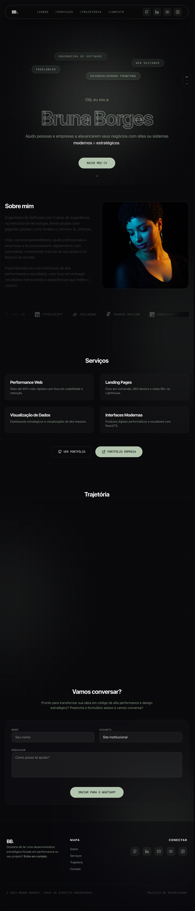

# Bruna Borges - Project Structure

Hey there! This is a special branch that serves as a **skeleton** and **documentation** reference for the project [brunaborges.com](https://brunaborges.com). 

### Preview

### What is this?
I created this branch to show how the project is organized without all the heavy logic or specific business features (like the lab or private links). It's a clean way to see the "bones" of the tech stack. 

And I don't want people to copy my code :D, but if you want to know how I built it, just ask me!

### Key Highlights:
- **Clean History**: This branch started fresh, so you won't find old deleted files here.
- **Organization**: Each folder has its own `README.md` explaining exactly why it's there and what goes inside.
- **Core Files**: We've kept the main routing and global styles so the architecture makes sense.

Feel free to browse around to understand the project's "vibe" and structure!
